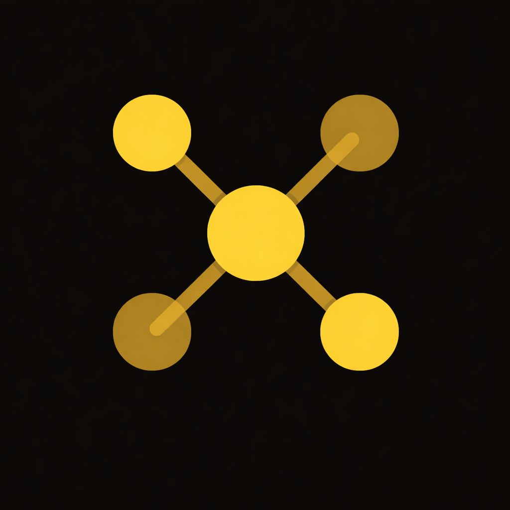

<div align="center">

<h1 align="center">
  
  OpenGraph AI
</h1>


### *Turning heterogeneous data into queryable knowledge graphs*

<p align="center">
  <a href="https://modelcontextprotocol.io">
    
  </a>
  <a href="https://github.com/OpenGraphAI/opengraph-ai/pulls?q=is%3Apr+is%3Aclosed">
  
</a>
<a href="https://github.com/OpenGraphAI/opengraph-ai/stargazers">
  
</a>
</p>

  <a href="https://discord.gg/PGFqf5amy6">
    
  </a>
  <a href="https://huggingface.co/OpenGraph-AI">
    
  </a>
  <a href="https://www.opengraphai.io">
    
  </a>
</p>

<p align="left">
`OpenGraph AI` turns tables, texts, images, audio and videos into queryable knowledge/context graphs to support complex reasoning and retrieval for AI systems, and lets users build effective and trusted AI agents.
</p>


<p align="left">
The first version of **`opengraph-image`** builds an MCP server and CLI that extract entities including **node**, **edge** and **relationships** from images.
</p>


</div>

---

## ✨ What is **`opengraph-image`**?

Most `image search` stops at keywords and captions. 

`opengraph-image` goes further to look at *every image in a folder*, identifies the `objects`, `scenes`,`attributes` and `relationship` in each one, and links them together into a **knowledge graph** — the same kind of structured representation that powers AI reasoning. 💭 

Once built, that graph is exposed through **5 simple** `MCP tools`, so any MCP-compatible agent (**Claude Code, Claude Desktop, Cursor**, etc.) can reason over your images conversationally:

- 🏗️ `build_graph` — point it at a folder, get back a fully built knowledge graph
- 🧠 `query_graph` — ask it anything, get back an answer grounded in the graph
- 🖼️ `get_image_entities` — drill into one image and see every entity and relationship it contains
- 📝   `list_images` — see every image currently represented in the graph
- 📊 `graph_summary` — get high-level stats about the graph at a glance

Fully run in your terminal. 

---

## 🚀 Quickstart

Try the whole pipeline locally before wiring it into an agent.


### 1. Install package
```bash
cd opengraph-image
pip install -e .
```

### 2. Set up API key (for example, use Anthropic API key)
```bash
cp .env.example .env
echo 'ANTHROPIC_API_KEY=your_anthropic_api_key_here' >> .env
```

### 3. Build a knowledge graph from a folder of images
```bash
# -> writes ./tests/sample_images/test_photos/opengraph-out/graph.json

opengraph-image build ./tests/sample_images/test_photos
```

### 4. Inspect what got extracted
```bash
opengraph-image summary ./tests/sample_images/test_photos
```

### 5. Ask a question over the graph
```bash
opengraph-image query "What's happening in the park photos?" \
  --graph ./tests/sample_images/test_photos/opengraph-out/graph.json
```

---

## 🔌 Using `opengraph-image` as an MCP server

😎 Instead of running the CLI yourself, let your AI coding agent drive the graph for you.

**Step 1 — Install the package** (same as above):

```bash
cd opengraph-image
pip install -e .
```

**Step 2 — Register the MCP server with Claude:**

```bash
claude mcp add opengraph-image -- opengraph-image-mcp
```

**Step 3 — Confirm it's connected:**

```bash
claude mcp list

# opengraph-image should show up as ✓ connected
```

**Step 4 — Ask in your Claude Chat session:**

> 🗣️ "Build a knowledge graph from the images in `./photos` and tell me which ones contain deciduous trees."

> 🗣️ "Query the graph: which images show a dog near a body of water?"

> 🗣️ "List every image you've ingested and summarize the graph."

Claude will call `build_graph`, `query_graph`, `get_image_entities`, `list_images`, and `graph_summary` on your behalf. You never have to touch JSON or write a query language. 🎉

> 💡 **Tip:** `opengraph-image` resolves graphs by folder, so as long as you tell the agent which folder your images live in, it'll find (or build) the right `opengraph-out/graph.json` automatically.

---

## 🧰 Available MCP Tools (v1)

| Tool | What it does |
|---|---|
| `build_graph(folder_path)` | Ingests every image in a folder and builds the knowledge graph |
| `query_graph(question, graph_path)` | Answers a natural-language question grounded in the graph |
| `get_image_entities(image_filename, graph_path)` | Returns all entities/edges connected to one image |
| `list_images(graph_path)` | Lists every image currently represented in the graph |
| `graph_summary(graph_path)` | Returns high-level stats about the graph |

---

## ⚙️ Use Cases (10x moonshot ideas)

### 🤖 Robotics

- Understand relationships between objects, locations, and tasks in their environment.
- Perform task planning by reasoning about object dependencies, required tools, and action sequences.
- Multi-robot systems can share a common knowledge graph to coordinate activities and exchange contextual information.

### 🖼️ Image & Video Search

- Images and videos can be converted into graph structures that connect detected objects, scenes, attributes, identity patterns, and event sequences
- Users can search for images or videos based on relationships, such as "person riding a bicycle near a building" rather than simple keyword matching

### 🔔 Multimodal AI Agents

- AI agents can combine information from text, images, audio, and video into a unified knowledge graph
- Structured graph representations improve retrieval, reasoning, and explainability for complex AI workflows

---

## 🤝 Contributing

`OpenGraph AI` is early, opinionated, and built in the open source, meaning your ideas can shape where it goes next. We'd love to have you.

- 🐛 **Found a bug or have a feature idea?** [Open an issue](https://github.com/OpenGraphAI/opengraph-ai/issues/new) — reproducible steps and context help us move fast.
- 🔧 **Want to fix something yourself?** Fork the repo, make your change under `opengraph-image/`, add a test, and [open a pull request](https://github.com/OpenGraphAI/opengraph-ai/pulls). We review fast and merge often.
- 💬 **Want to talk it through first?** Hop into our [Discord](https://discord.gg/PGFqf5amy6) — describe what you're thinking and we'll help you find the right entry point.
- ✉️ **Prefer email?** Reach out directly at [team@opengraphai.io](mailto:team@opengraphai.io) — we read everything and reply to humans, not just issues.
- 🙋 **Want to reach a maintainer 1:1?** Don't be shy — tag us in an issue or DM us on Discord. We're genuinely excited to hear what you're building on top of this.

No contribution is too small: typo fixes, new test images, extraction edge cases, and wild "what if it could also do X" ideas are all welcome. 🌱

---

## 📄 License

Licensed under the [Apache License 2.0](LICENSE).
